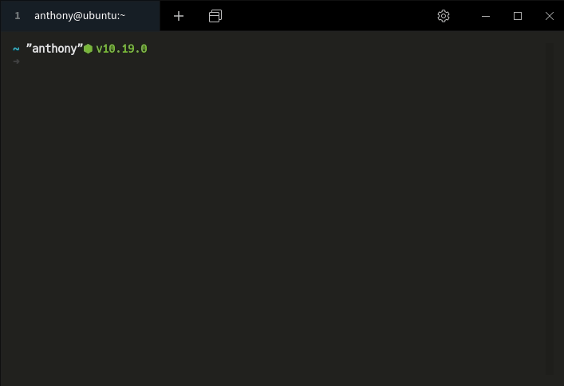

# npx_brignano <a href="#"></img></a>

An interactive shell experience that renders my business card in your terminal.

👇 just hit 
```bash
npx brignano
```

### DEMO

# npx-brignano <a href="#"></img></a>

An interactive terminal business card for Anthony Brignano. Run it with `npx` to view a styled card in your terminal and choose quick actions like emailing or downloading a resume.

Quick start

```bash
npx brignano
```

Demo



What it does

- Renders a boxed, colored business card in the terminal using `boxen` and `chalk`.
- Presents a small interactive menu (via `inquirer`) with actions:
  - Send an email (opens your mail client with `mailto:`)
  - View the resume (opens https://brignano.io/resume in your browser)
  - Quit

CLI

The CLI supports both interactive mode (default) and non-interactive flags. Run `npx brignano --help` to see the same help output.

- `-h, --help` — Show help and exit.
- `-v, --view` — Open the resume in the default browser (`https://brignano.io/resume`).
- `-d, --download` — Deprecated alias; now opens the resume in the browser and prints a deprecation warning.
- `-e, --email` — Open the default mail client with a new message to `hi@brignano.io`.
- `--no-prompt` — Show the card only and exit (non-interactive).

Examples

Run interactively (default):
```bash
npx brignano
```

Open resume directly in browser:
```bash
npx brignano --view
# or
npx brignano -v
```

Open mail client to email Anthony:
```bash
npx brignano --email
# or
npx brignano -e
```

Show card only (useful in CI or scripts):
```bash
npx brignano --no-prompt
```

Files

- `card.js` — main CLI script: prints the card and runs the interactive menu.
- `package.json` — project metadata and `bin` entry used by `npx`.

Usage

- Run directly with `npx brignano` (no install required).
- Or clone and run locally:

```bash
git clone https://github.com/brignano/npx_brignano.git
cd npx-brignano
npm install
node card.js
```

Prerequisites

- Node.js (tested with Node 14+). `npx` is included with npm.

Notes

- When you choose "Download my Resume" the script requests the resume URL and writes `anthony-brignano.html` into the current working directory, then opens it.
- Links printed in the card may be cmd/ctrl+clickable in supported terminals.

Credits

This project is inspired by and credited to [anmol098/npx_card](https://github.com/anmol098/npx_card).

License

See `package.json` for license information.
